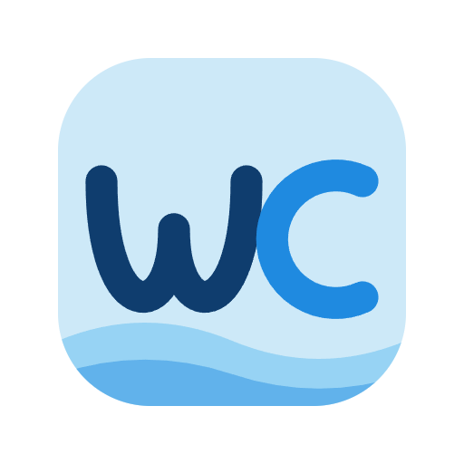

<div align="center">

<picture>
  <source media="(prefers-color-scheme: dark)" srcset="docs/images/logo/wave-client-logo-dark.png">
  
</picture>

# Wave Client

</div>


### A modern, platform‑agnostic REST API client

Build and send requests, organize them into collections, parameterize with environments, validate responses, chain requests into flows and test suites, and even ask a built‑in AI assistant for help.

Available today as a **VS Code extension** and a **web app** — and architected so new clients (a CLI and beyond) can be built on the same core. See [Build Your Own Client](docs/build-your-own-client.md).

**Public beta** · See the [Release Notes](docs/release-notes.md) for what's included.


---

## Documentation

**Full documentation lives in [`docs/`](docs/README.md) — start there.**

Quick links:
- [Installation](docs/getting-started/installation.md) · [Quick Start](docs/getting-started/quick-start.md)
- Features: [Requests](docs/features/requests.md) · [Collections](docs/features/collections.md) · [Environments](docs/features/environments.md) · [Variables](docs/features/variables.md) · [Auth](docs/features/auth.md) · [Validations](docs/features/validations.md) · [Wave Store](docs/features/wave-store.md) · [Flows](docs/features/flows.md) · [Test Lab](docs/features/tests.md) · [Reporting](docs/features/reporting.md) · [Settings](docs/features/settings.md) · [AI & Wave Arena](docs/features/ai-arena.md)
- Platforms: [VS Code](docs/platforms/vscode.md) · [Web app](docs/platforms/web-app.md)
- [Design & Architecture](docs/design.md)

> Inside either app, click the **Documentation** icon in the left sidebar to open these docs.

---

## What you can do

- **Requests beyond HTTP** — HTTP, **WebSocket**, and **SSE**, with rich body editors and a "Sent" view of the exact outgoing request.
- **Organize** — nested [collections](docs/features/collections.md) with import (Postman, OpenAPI/Swagger, HTTP) and export.
- **Parameterize** — [environments](docs/features/environments.md), `{{variables}}`, and dynamic [`_fn_` functions](docs/features/variables.md).
- **Authenticate** — API Key, Basic, Digest, OAuth2 (Refresh, Client Credentials, Authorization Code/PKCE), and HMAC, plus a reusable [Wave Store](docs/features/wave-store.md) for cookies, auth, proxies, and certificates.
- **Validate** — response checks via [JSONPath and JSON Schema](docs/features/validations.md).
- **Automate** — [flows](docs/features/flows.md), [test suites](docs/features/tests.md), and exportable [run reports](docs/features/reporting.md).
- **AI built in** — [Wave Arena](docs/features/ai-arena.md) and an MCP server for external AI tools.

---

## Clients

Wave Client runs as multiple clients over one shared, platform‑agnostic core. Two are available today, and the [adapter architecture](docs/design.md) makes it straightforward to add more.

### VS Code extension
Run **Wave Client: Open Wave Client** from the Command Palette, or press **`Ctrl+Alt+W`** / **`Cmd+Alt+W`**. → [VS Code guide](docs/platforms/vscode.md)

### Web app
> **🚧 Not yet published — coming soon.** The npm command below is a preview. For now, run it from source in dev mode (Contributors only).

Once published, install from npm and run a single command — it starts the bundled local server, serves the UI, and opens your browser:
```bash
npx @abranjith/wave-client          # or: npm i -g @abranjith/wave-client && wave-client
```
Contributors can run it from source in dev mode (`pnpm install && pnpm dev:web` → http://localhost:5173).
→ [Web app guide](docs/platforms/web-app.md)

### Build your own
The core isn't tied to these two — a CLI, desktop, or other client is just a new adapter. → [Build Your Own Client](docs/build-your-own-client.md)

---

## Architecture, in brief

Wave Client is a **monorepo** built around the **adapter pattern**: a platform‑agnostic core UI is shared across platforms, and platform‑specific I/O is isolated behind adapters.

| Package | Role |
| --- | --- |
| `packages/core` | Platform‑agnostic UI, state, and logic |
| `packages/vscode` | VS Code extension |
| `packages/web` | Browser app |
| `packages/server` | Local backend for the web app |
| `packages/web-app` | Publishable npm package — bundles server + UI into the `wave-client` CLI |
| `packages/shared` | Shared Node‑side services |
| `packages/arena` | AI engine (Wave Arena) |
| `packages/mcp-server` | MCP server for external AI tools |

Because of this, adding a new client (a CLI, a desktop app, …) means implementing one adapter rather than rebuilding the app. Full details in the [Design & Architecture guide](docs/design.md) and the [Build Your Own Client](docs/build-your-own-client.md) guide.

---

## Versioning

Wave Client versions four things independently, each with its own semver: the **VS Code extension**, the **web app**, the **core platform** (the five shared packages, bumped in lockstep), and the **Wave schemas** (the persisted collection/environment file formats, which only move when the on‑disk shape changes). Releases are manual checklists for now — the tracks, semantics, and step‑by‑step bump procedures are documented in [docs/versioning.md](docs/versioning.md).

---

## Future peek

Wave Client is actively evolving. On the radar (subject to change):

- Additional client types — a CLI and beyond — on the same shared core.
- Allow users to include wave client files in their own repos, and use them with the CLI.
- More storage support - cloud drives, database etc., beyond local filesystem storage
- Ability to secure wave client files with encryption and password protection.
- A deeper Test Lab (schema validation, performance plans, history & insights) and richer reporting.
- More AI capabilities and broader provider support. Provide ability for agents to create requests, tests, run and analyze results, and more.
- Team collaboration - workspaces, users and permissions, and more.
- A better design system / class library to make styling consistent across apps
- Dockerization and other improvements to make self‑hosting easier.
- Mock server support

---

## Feedback & Community

Wave Client is in public beta and your input directly shapes what gets built next.

**Found a bug?** [Open a bug report](https://github.com/abranjith/wave-client-support/issues/new?template=bug_report.md) — the more detail you include (environment, steps to reproduce, a HAR file if relevant), the faster it gets fixed.

**Have an idea?** [Open a feature request](https://github.com/abranjith/wave-client-support/issues/new?template=feature_request.md) — new platform clients (CLI, desktop, …) are explicitly welcome, not just improvements to the existing ones.

**Browse existing issues** before opening a new one — upvoting an existing issue is the best signal that something matters.

### Contributing

The project isn't accepting pull requests yet — the codebase is still moving fast and we want to get the foundations more stable first. Watch this space; PRs will be welcome soon and contribution guidelines will be published here when that opens.

In the meantime, the highest-value contributions are **bug reports, feature requests, and feedback** through GitHub Issues.

---

## Credits

Wave Client stands on excellent open‑source work, including:

- **UI**: [React](https://react.dev/), [Tailwind CSS](https://tailwindcss.com/), [Radix UI](https://www.radix-ui.com/), [lucide‑react](https://lucide.dev/), [highlight.js](https://highlightjs.org/), [cmdk](https://cmdk.paco.me/)
- **State**: [Zustand](https://github.com/pmndrs/zustand)
- **Tooling/build**: [Vite](https://vitejs.dev/), [Webpack](https://webpack.js.org/), [Turborepo](https://turbo.build/), [TypeScript](https://www.typescriptlang.org/)
- **HTTP & server**: [axios](https://axios-http.com/), [Fastify](https://fastify.dev/)
- **Parsing & validation**: [@scalar/openapi-parser](https://github.com/scalar/scalar), [jsonpath‑plus](https://github.com/JSONPath-Plus/JSONPath), [ajv](https://ajv.js.org/)
- **AI**: [LangChain.js & LangGraph.js](https://www.langchain.com/), [Model Context Protocol SDK](https://modelcontextprotocol.io/), [hnswlib‑node](https://github.com/yoshoku/hnswlib-node)

And many more. Grateful to all the maintainers of these projects (and to the open‑source ecosystem as a whole), without whom this project wouldn't be possible.

---

## License

See the [LICENSE](LICENSE) file for details.
