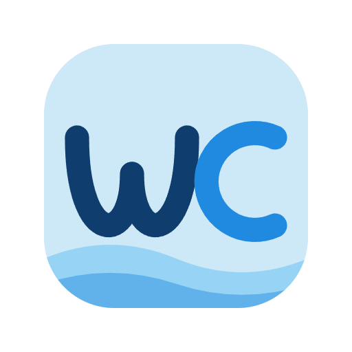

<div align="center">

<picture>
  <source media="(prefers-color-scheme: dark)" srcset="docs/images/logo/wave-client-logo-dark.png">
  
</picture>

# Wave Client

</div>


### A completely offline, local‑first API client and Postman alternative — no login, with built‑in AI tools

Wave Client is a privacy‑respecting, lightweight API client for developers, QA engineers, and IT professionals who want a no‑nonsense environment to test and manage APIs. Available both as a native **VS Code extension** and a self‑hostable **web app** (*coming soon*), it runs **100% locally** on your machine.

- **100% local‑first & offline** — your data stays entirely on your machine. No mandatory cloud sync, no tracking telemetry.
- **Zero sign‑in nonsense** — start testing right away without creating yet another SaaS account.
- **Seamless VS Code integration** — manage environments, global variables, and request collections natively within your workspace.
- **Self‑hostable** — run it on your own infrastructure via Docker for maximum data control.

Build and send requests, organize them into collections, parameterize with environments, validate responses, chain requests into flows and test suites, and even ask a built‑in AI assistant for help. Architected so new clients (a CLI and beyond) can be built on the same core — see [Build Your Own Client](docs/build-your-own-client.md).

**Public beta** · See the [Release Notes](docs/release-notes.md) for what's included.


---

## Documentation

**Full documentation lives in [`docs/`](docs/README.md) — start there.**

Quick links:
- [CLI (`wvc`)](docs/platforms/cli.md) for terminal, CI, and AI-agent workflows
- [Installation](docs/getting-started/installation.md) · [Quick Start](docs/getting-started/quick-start.md)
- Features: [Requests](docs/features/requests.md) · [Collections](docs/features/collections.md) · [Environments](docs/features/environments.md) · [Variables](docs/features/variables.md) · [Auth](docs/features/auth.md) · [Validations](docs/features/validations.md) · [Wave Store](docs/features/wave-store.md) · [Flows](docs/features/flows.md) · [Test Lab](docs/features/tests.md) · [Reporting](docs/features/reporting.md) · [Settings](docs/features/settings.md) · [AI & Wave Arena](docs/features/ai-arena.md)
- Platforms: [VS Code](docs/platforms/vscode.md) · [Web app](docs/platforms/web-app.md)
- [Design & Architecture](docs/design.md)

> Inside either app, click the **Documentation** icon in the left sidebar to open these docs.

---

## What you can do

- **Requests beyond HTTP** — HTTP, **WebSocket**, and **SSE**, with rich body editors and a "Sent" view of the exact outgoing request.
- **Organize** — nested [collections](docs/features/collections.md) with import (Postman, OpenAPI/Swagger, HTTP) and export.
- **Parameterize** — [environments](docs/features/environments.md), `{{variables}}`, and dynamic [`_fn_` functions](docs/features/variables.md).
- **Authenticate** — API Key, Basic, Digest, OAuth2 (Refresh, Client Credentials, Authorization Code/PKCE), and HMAC, plus a reusable [Wave Store](docs/features/wave-store.md) for cookies, auth, proxies, and certificates.
- **Validate** — response checks via [JSONPath and JSON Schema](docs/features/validations.md).
- **Automate** — [flows](docs/features/flows.md), [test suites](docs/features/tests.md), and exportable [run reports](docs/features/reporting.md).
- **AI built in** — [Wave Arena](docs/features/ai-arena.md) and an MCP server for external AI tools.

---

## Clients

Wave Client runs as three shipped clients over one shared, platform-agnostic core.

### VS Code extension
Run **Wave Client: Open Wave Client** from the Command Palette, or press **`Ctrl+Alt+W`** / **`Cmd+Alt+W`**. → [VS Code guide](docs/platforms/vscode.md)

### Web app
> **🚧 Not yet published — coming soon.** The npm command below is a preview. For now, run it from source in dev mode (Contributors only).

Once published, install from npm and run a single command — it starts the bundled local server, serves the UI, and opens your browser:
```bash
npx @abranjith/wave-client          # or: npm i -g @abranjith/wave-client && wave-client
```
Contributors can run it from source in dev mode (`pnpm install && pnpm dev:web` → http://localhost:5173).
→ [Web app guide](docs/platforms/web-app.md)

### CLI (`wvc`)

Use the shipped headless client in a terminal, script, CI job, or AI-agent workflow:

```bash
npm install -g @abranjith/wave-client-cli
wvc docs --json
```

See the [CLI guide](docs/platforms/cli.md).

### Build your own
The core isn't tied to these two — a CLI, desktop, or other client is just a new adapter. → [Build Your Own Client](docs/build-your-own-client.md)

---

## Architecture, in brief

Wave Client is a **monorepo** built around the **adapter pattern**: a platform‑agnostic core UI is shared across platforms, and platform‑specific I/O is isolated behind adapters.

| Package | Role |
| --- | --- |
| [`packages/core`](packages/core/README.md) | Platform‑agnostic UI, state, and logic |
| [`packages/vscode`](packages/vscode/README.md) | VS Code extension |
| [`packages/web`](packages/web/README.md) | Browser app |
| [`packages/server`](packages/server/README.md) | Local backend for the web app |
| `packages/web-app` | Publishable npm package — bundles server + UI into the `wave-client` CLI |
| [`packages/shared`](packages/shared/README.md) | Shared Node‑side services |
| [`packages/arena`](packages/arena/README.md) | AI engine (Wave Arena) |
| [`packages/mcp-server`](packages/mcp-server/README.md) | MCP server for external AI tools |
| [`packages/cli`](packages/cli/README.md) | Headless `wvc` command-line client |

Because of this, adding a new client (a CLI, a desktop app, …) means implementing one adapter rather than rebuilding the app. Full details in the [Design & Architecture guide](docs/design.md) and the [Build Your Own Client](docs/build-your-own-client.md) guide.

---

## Versioning

Wave Client versions five things independently: the **VS Code extension**, **web app**, **CLI**, **core platform**, and **Wave schemas**. The semver tracks and manual bump checklists are documented in [docs/versioning.md](docs/versioning.md).

---

## Future peek

Wave Client is actively evolving. On the radar (subject to change):

- Additional client types — a CLI and beyond — on the same shared core.
- Allow users to include wave client files in their own repos, and use them with the CLI.
- More storage support - cloud drives, database etc., beyond local filesystem storage
- Ability to secure wave client files with encryption and password protection.
- A deeper Test Lab (schema validation, performance plans, history & insights) and richer reporting.
- More AI capabilities and broader provider support. Provide ability for agents to create requests, tests, run and analyze results, and more.
- Team collaboration - workspaces, users and permissions, and more.
- A better design system / class library to make styling consistent across apps
- Dockerization and other improvements to make self‑hosting easier.
- Mock server support

---

## Feedback & Community

Wave Client is in public beta and your input directly shapes what gets built next.

**Found a bug?** [Open a bug report](https://github.com/abranjith/wave-client-support/issues/new?template=bug_report.md) — the more detail you include (environment, steps to reproduce, a HAR file if relevant), the faster it gets fixed.

**Have an idea?** [Open a feature request](https://github.com/abranjith/wave-client-support/issues/new?template=feature_request.md) — new platform clients (CLI, desktop, …) are explicitly welcome, not just improvements to the existing ones.

**Browse existing issues** before opening a new one — upvoting an existing issue is the best signal that something matters.

### Contributing

The project isn't accepting pull requests yet — the codebase is still moving fast and we want to get the foundations more stable first. Watch this space; PRs will be welcome soon and contribution guidelines will be published here when that opens.

In the meantime, the highest-value contributions are **bug reports, feature requests, and feedback** through GitHub Issues.

---

## Credits

Wave Client stands on excellent open‑source work, including:

- **UI**: [React](https://react.dev/), [Tailwind CSS](https://tailwindcss.com/), [Radix UI](https://www.radix-ui.com/), [lucide‑react](https://lucide.dev/), [highlight.js](https://highlightjs.org/), [cmdk](https://cmdk.paco.me/)
- **State**: [Zustand](https://github.com/pmndrs/zustand)
- **Tooling/build**: [Vite](https://vitejs.dev/), [Webpack](https://webpack.js.org/), [Turborepo](https://turbo.build/), [TypeScript](https://www.typescriptlang.org/)
- **HTTP & server**: [axios](https://axios-http.com/), [Fastify](https://fastify.dev/)
- **Parsing & validation**: [@scalar/openapi-parser](https://github.com/scalar/scalar), [jsonpath‑plus](https://github.com/JSONPath-Plus/JSONPath), [ajv](https://ajv.js.org/)
- **AI**: [LangChain.js & LangGraph.js](https://www.langchain.com/), [Model Context Protocol SDK](https://modelcontextprotocol.io/), [hnswlib‑node](https://github.com/yoshoku/hnswlib-node)

And many more. Grateful to all the maintainers of these projects (and to the open‑source ecosystem as a whole), without whom this project wouldn't be possible.

---

## Important Notice

> [!IMPORTANT]
> Wave Client is free to use.
> You should never pay anyone (in crypto or otherwise) to access or use this software.
> Any person, group, or service demanding payment while claiming it is required for Wave Client is not affiliated with the project and is likely a scam.
> Please do not encourage or support such requests.

---

## License

See the [LICENSE](LICENSE) file for details.
