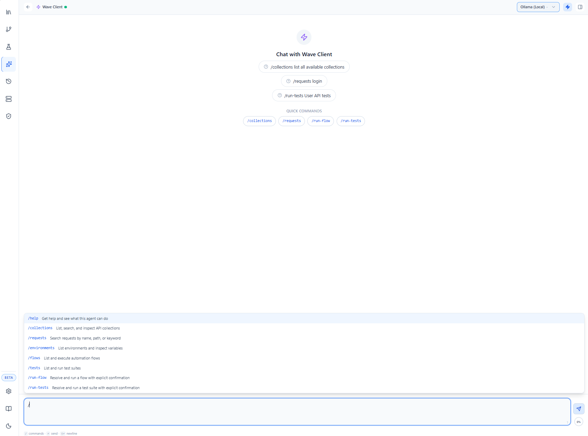

# AI & Wave Arena

**Wave Arena** is Wave Client's built‑in AI assistant. Open it from the **Wave Arena** tab in the sidebar. It brings two kinds of help into the app:

- **Web expertise** — answers about web standards and protocols (HTTP, real‑time, RPC, API design, security, the web platform), grounded in authoritative sources.
- **Workspace assistance** — questions and actions about *your* Wave Client workspace (collections, requests, environments, flows, tests), backed by tools rather than guesswork.

---

## Commands

Wave Arena understands a set of slash commands as well as free‑form questions:

| Command | What it does |
| --- | --- |
| `/help` | List available commands |
| `/collections` | List your collections |
| `/requests` | List requests |
| `/environments` | List environments |
| `/flows` | List flows |
| `/tests` | List test suites |
| `/run-flow` | Run a flow (asks you to confirm the target first) |
| `/run-tests` | Run a test suite (asks you to confirm the target first) |

Workspace answers are **tool‑backed**: the assistant won't fabricate collections, environments, flows, or tests, and run actions (`/run-flow`, `/run-tests`) require explicit confirmation before anything executes.

---

## Configuring the assistant

Pick your AI provider and model in **Settings → Arena / AI Settings** (see [Settings](settings.md)). Provider availability evolves during the beta.

---

## MCP server (for external AI tools)

Wave Client also ships an **MCP (Model Context Protocol) server** that exposes your workspace to *external* AI agents (for example, an AI assistant in another tool). Through it, an agent can inspect collections and requests, search endpoints, read environments (with secrets masked), and list/run flows and test suites.

Available tools include `list_collections`, `search_requests`, `list_flows`, `run_flow`, `list_test_suites`, and `run_test_suite`.

> For setup and the full tool list, see the package reference: [`packages/mcp-server/README.md`](../../packages/mcp-server/README.md).

---

## Related guides
- [Settings](settings.md) — choose the AI provider/model
- [Flows](flows.md) and [Test Lab](tests.md) — what `/run-flow` and `/run-tests` operate on
- [Design & Architecture](../design.md) — how the AI engine fits the codebase
