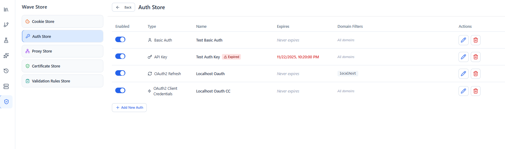

# Authentication

Wave Client can attach authentication to your requests and reuse credentials across many requests. This page covers the supported auth types and where they apply.

---

## Supported auth types

| Type | What it sends | Key options |
| --- | --- | --- |
| **API Key** | A key as a header or query parameter | `key`, `value`, send in **header** or **query**, optional **prefix** (e.g. `Bearer `, `Token `) |
| **Basic** | `Authorization: Basic …` | `username`, `password` |
| **Digest** | HTTP Digest challenge/response | `username`, `password` only — every other digest parameter (`realm`, `nonce`, `algorithm`, `qop`, …) is taken from the server challenge automatically |
| **OAuth2 (Refresh Token)** | A bearer access token obtained from a refresh token | `tokenUrl`, `clientId`, `clientSecret`, `refreshToken`, `scope`, **client auth method**; the access token is cached and refreshed as needed |
| **OAuth2 (Client Credentials)** | A bearer access token from the machine‑to‑machine `client_credentials` grant | `tokenUrl`, `clientId`, `clientSecret`, optional `scope` and `audience`, **client auth method** |
| **OAuth2 (Authorization Code + PKCE)** | A bearer access token acquired interactively (with a manual code/URL paste), then refreshed | `authorizationUrl`, `tokenUrl`, `clientId`, optional `clientSecret`, `redirectUri`, optional `scope`, **code challenge method**, **client auth method** |
| **HMAC** | A computed HMAC signature placed in a header or query parameter | `algorithm`, `secretKey`, optional `keyId`, **signature template**, **output encoding**, **send in** (header/query), **target name**, optional `prefix`/timestamp/nonce headers |

> **Bearer tokens:** there isn't a separate "Bearer" type — use **API Key**, send it in the **header** named `Authorization`, with the prefix `Bearer `.

Each saved credential also carries common options: a unique **name**, an **enabled** flag, **domain filters** (so a credential is only applied to matching hosts), and an optional **expiry date**.

### No assumed defaults

Auth configuration follows a strict **no‑assumed‑defaults** policy: you supply every value that affects how a credential is computed or transmitted. In particular, the OAuth2 **client auth method** (`basic` = `client_secret_basic` vs `body` = `client_secret_post`), the Authorization Code **challenge method** (`S256` — recommended — vs `plain`), and the HMAC **algorithm** and **output encoding** have **no preselected value** — pick one explicitly. If a token endpoint omits `expires_in`, Wave Client does not invent a lifetime; it fetches a fresh token per request instead of caching one with a fabricated TTL.

---

## OAuth2

All four OAuth2 variants share the same token‑endpoint mechanics; they differ only in how the token is obtained.

### OAuth2 Client Credentials

For machine‑to‑machine APIs. Provide the **Token URL**, **Client ID**, **Client Secret**, a required **Client Auth Method**, and (when the provider needs them) **Scope** and **Audience**. At request time Wave Client requests a token with `grant_type=client_credentials`, caches it for its lifetime, and applies it as `Authorization: <tokenType> <accessToken>`.

### OAuth2 Authorization Code (PKCE, manual paste)

For user‑delegated access. Because Wave Client has no hosted redirect listener, the authorization step is **manual paste**:

1. **Configure** the **Authorization URL**, **Token URL**, **Client ID**, optional **Client Secret** (omit for public PKCE clients), **Redirect URI** (must match what you registered with the provider), optional **Scope**, a required **Code Challenge Method** (`S256` recommended), and **Client Auth Method**.
2. **Generate & Open** — Wave Client creates a PKCE `code_verifier`/`code_challenge` and a `state`, builds the authorize URL, and lets you open it externally (or copy it).
3. Authorize in your browser, then **paste back** the resulting authorization `code` (or the full redirect URL).
4. **Exchange** — Wave Client validates `state`, exchanges the `code` + `code_verifier` for tokens through the platform HTTP client (so proxy/cert settings apply), and stores the `accessToken`/`refreshToken`/`tokenType`/expiry on the credential.

At request time the stored access token is applied; if it has expired and a refresh token exists, it is refreshed transparently. If there is no usable token and no refresh token, the request surfaces a clear "re‑authorize" error.

> Authorization codes are single‑use and short‑lived — exchange immediately after pasting.

---

## HMAC

HMAC signs each request with a shared secret — no interactive step. At request time Wave Client renders your **signature template** against the live request, computes `HMAC(algorithm, secretKey)`, encodes it, and places the result under your chosen header or query parameter.

Configure:

- **Algorithm** — `sha256` / `sha1` / `sha512` / `md5` (no default).
- **Secret Key** — the shared secret (masked).
- **Key ID** — optional public key identifier, when the scheme includes one.
- **Signature Template** — the string‑to‑sign, using the placeholders below.
- **Output Encoding** — `hex` or `base64` (no default).
- **Send In** / **Target Name** — header or query parameter, and its name.
- **Prefix** — optional scheme label prepended to the signature (e.g. `"HMAC "`).
- **Timestamp Header** / **Nonce Header** — optional headers that carry the generated `{timestamp}` / `{nonce}` so the server can verify them.

**Signature template placeholders** (resolved against the outgoing request; `{{env}}` variables are resolved first):

| Placeholder | Value |
| --- | --- |
| `{method}` | HTTP method, upper‑case |
| `{url}` | The full request URL |
| `{path}` | URL path |
| `{query}` | Raw query string (no leading `?`) |
| `{host}` | Host |
| `{body}` | Raw request body as a string |
| `{timestamp}` | Generated Unix timestamp (seconds) |
| `{nonce}` | Generated random hex nonce |

Example: signing `{method}\n{path}\n{timestamp}` into an `X-Signature` header with a companion `X-Timestamp` header.

---

## Where auth applies

- **Per request** — choose an auth type directly on a request.
- **Saved & reused** — store credentials once in the [Wave Store → Auth](wave-store.md) and reference them from multiple requests, with **domain filters** controlling where each one is sent.

### Real‑time protocols
For [WebSocket and SSE](requests.md) connections, auth resolution supports **API key**, **Bearer** (via API Key with a prefix), and **Basic**. Digest is not applied to WS/SSE connections.

---

## Related guides
- [Wave Store](wave-store.md) — save and manage reusable credentials
- [Requests](requests.md) — attach auth to a request
- [Environments](environments.md) / [Variables](variables.md) — keep secrets out of requests using `{{variables}}`
