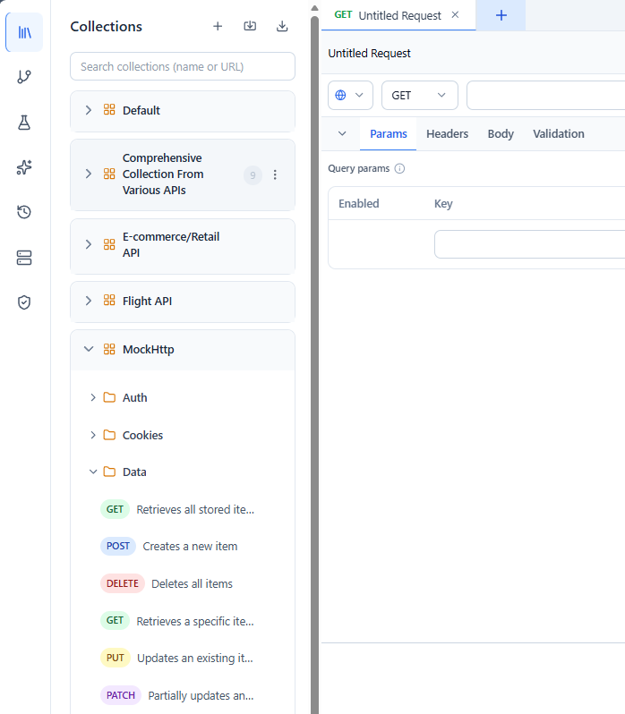
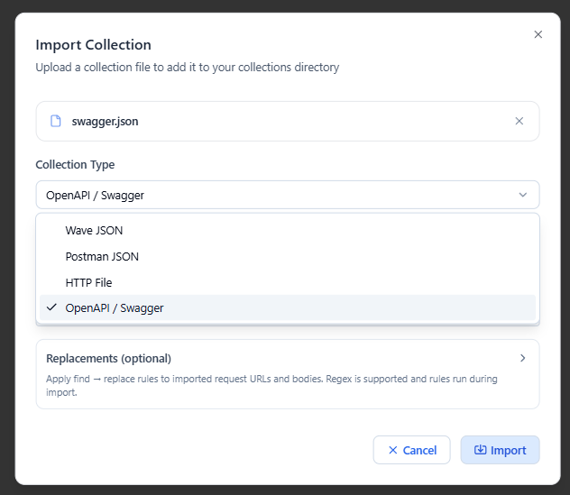
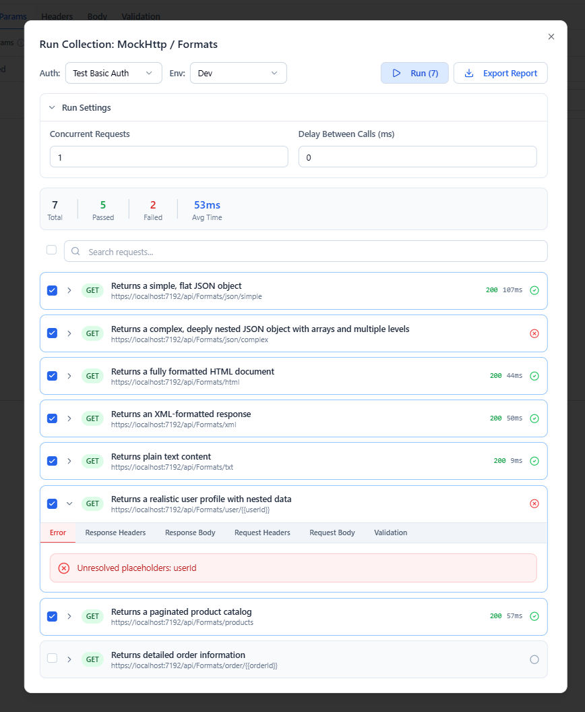

# Collections

A **collection** is a named group of saved requests, organized into nested folders. Collections are how you keep an API project tidy, reuse requests, and run many requests at once.

---

## Structure

A collection contains **folders** and **requests** in a tree:

```text
My API (collection)
├── Auth
│   ├── Login        (request)
│   └── Refresh      (request)
└── Users
    ├── List Users   (request)
    └── Get User     (request)
```

Open the **Collections** tab in the sidebar to browse the tree. Collections can hold HTTP, WebSocket, and SSE requests side by side — see [Requests](requests.md).

The pane header includes three quick actions:

- **Add Collection (`+`)** — create a new empty Wave collection file from a name.
- **Import** — import collections from Wave, Postman, OpenAPI/Swagger, or `.http` files.
- **Export** — export a collection to file.



---

## Working with items

Each collection, folder, and request row has an action menu with consistent operations:

- **Run** — run the item (a request, or everything under a collection/folder).
- **Rename** — inline rename, with sibling‑level uniqueness checks (press **Enter** to commit, **Escape** to cancel).
- **Delete** — guarded by a confirmation dialog (deleting a folder removes its whole subtree).
- **New Folder** — create a validated empty folder under a collection or any folder, from the collection header or a folder's menu. The name must be non‑empty and unique among its siblings (case‑insensitive); the new folder appears expanded in place.

Both **folders** and **requests** support:

- **Move** — relocate the item to another collection or folder. The dialog offers a single searchable destination picker listing every collection and folder (any depth); you can also create a new collection on the spot. A **folder** moves with its **entire subtree** intact.
  - The move is **atomic** and **validate‑first**: every check (existence, same‑location, name conflict, and — for folders — that you aren't moving a folder into itself or one of its own descendants) runs before anything is written. A cross‑collection move that fails midway is rolled back, so the item is never left in both places or neither.
  - **Conflict protection** — the move is blocked when the destination already contains an item with the same name (case‑insensitive), preventing silent overwrite.
  - Open tabs and expanded‑folder state are remapped to the new location, so a tab opened from inside a moved folder still saves back to the right place.

Requests additionally support:

- **Duplicate** — deep‑copy a request with a fresh ID and a collision‑safe name (`Copy`, `Copy 2`, …).

---

## Importing

Wave Client imports several formats and converts them into Wave collections automatically:

- **Postman Collection** (v2.1.0)
- **OpenAPI / Swagger** — OpenAPI 3.x and Swagger 2.0, in **JSON or YAML** (inline `$ref`s are resolved during import). When the spec declares no server URL, request URLs are prefixed with a generated placeholder derived from the collection name (e.g. `{{PetstoreAPIUrl}}/path`) for you to fill in — rather than a fake host.
- **HTTP** files (`.http` / `.rest`) — the [ASP.NET Core / VS Code REST Client format](https://learn.microsoft.com/en-us/aspnet/core/test/http-files), with full syntax support:
  - Requests separated by `###` lines (text after `###` becomes the request name)
  - `#` and `//` comments anywhere outside the body; `# @name requestName` (or `// @name`) directives name a request explicitly
  - Optional method (defaults to `GET`), all standard methods plus `TRACE`/`CONNECT`, trailing `HTTP/x.y` ignored
  - Multi-line URLs — continuation lines starting with `?` or `&` are appended to the URL
  - File variables (`@var=value`) are recognized and skipped; `{{var}}` references pass through **unresolved** (resolve them with Wave [environments](environments.md) after import)
  - Request names are made unique automatically (` 2`, ` 3`, … suffixes); unnamed requests get a name derived from the URL



Native **Wave** collection files import directly. Other formats are transformed on import so requests, grouping, bodies, headers, and query parameters carry over.

**Format auto-detection**: when you select a file the wizard reads its content and detects the format automatically — a Postman export renamed to `collection.json`, an OpenAPI YAML file named `spec.txt`, or an `.http` file with any name all resolve to the right format. The detection priority is: file content first (JSON registry order: OpenAPI → Postman → Wave; YAML `openapi:`/`swagger:` key; HTTP file syntax), then filename as a fallback. The **Collection Type** dropdown shows the detected choice; select a different value to override it before importing.

### Where the import lands

The import wizard's **Import Into** section lets you choose the destination:

- **Create new collection** (default) — you provide an explicit name (prefilled from the file's own name when available). The name must be non‑empty and unique across collections, and Wave Client always writes to a fresh file, so a same‑named import never silently overwrites an existing collection.
- **Existing collection** — pick a collection root or any folder via the destination picker. The imported file's top‑level items are merged in with fresh IDs. Merging is **all‑or‑nothing**: if any incoming name collides (case‑insensitive) with an item already at the destination, the whole import is rejected and nothing changes.

Imported files are validated against the [Wave Collection Schema](../schemas.md) before anything is written — malformed files are rejected with a descriptive error. The schema reference documents every field of the persisted format.

### Import‑time replacements

Imports can apply a set of **find → replace** rules to the requests before the collection is saved — handy for adapting a borrowed collection to your own setup in one step. Each rule is a `find → replace` pair with an optional **regex** flag; an "Add replacement" grid in the import wizard (shown once a file is selected) collects them.

Typical uses:

- Replace a hard‑coded host from a Swagger/OpenAPI spec (`api.example.com`) with a variable placeholder (`{{ApiBaseUrl}}`).
- Rename Postman‑style variables to your own (`{{oldVar}}` → `{{myVar}}`).

Notes:

- **Scope is request URLs and bodies only.** Header and query‑param keys/values, item names, and descriptions are left untouched (planned to widen later).
- Literal rules replace **all** occurrences; regex rules compile with the global flag and support capture groups (`$1`). A rule with an empty find is ignored, and an invalid regex is flagged inline and blocks the import until fixed.
- Rules are **one‑off per import** — they are applied during this import and not remembered. When no rules are entered, the import path is unchanged.

**Naming rules** (enforced on every save and rename): names must be non-empty, folder and request names must be unique among their siblings (case-insensitive), and collection names must be unique across collections. Renaming a request updates the request itself atomically, and item identity (`id`) is stable across rename, move, and duplicate.

---

## Exporting

Export a collection to share it or back it up. Use the export action on a collection to write it to a file.

---

## Running a collection

Run a whole collection (or a folder) to execute its requests in sequence. Results are summarized in a **result explorer**, and you can generate a shareable report — see [Reporting](reporting.md).



---

## Related guides
- [Requests](requests.md) — build the requests you save here
- [Environments](environments.md) — switch base URLs and values per stage
- [Reporting](reporting.md) — export results of a collection run
- [Flows](flows.md) — chain saved requests with data passing between them
