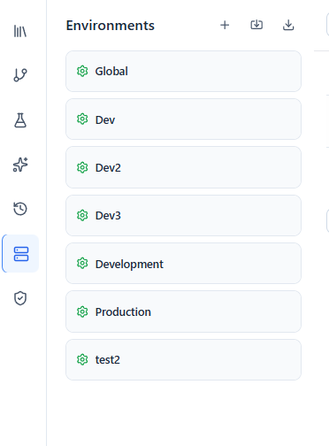
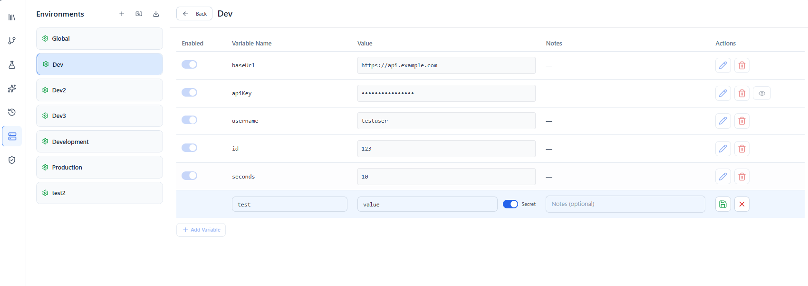

# Environments

An **environment** is a named set of variables — like `Dev`, `Staging`, and `Production` — that let you reuse the same requests against different targets by swapping values instead of editing requests.

You reference environment variables anywhere with `{{variableName}}`. For the full resolution rules and dynamic functions, see [Variables](variables.md).

---

## Environment variables

Each environment holds a list of **key/value** pairs (with optional notes), and each value can be enabled or disabled. Manage them from the **Environments** tab in the sidebar.

Open an environment to edit its variables in a grid:

---

## Global vs. environment scope

Wave Client supports two scopes:

- **Global values** — available regardless of which environment is selected. Good for values that rarely change across stages.
- **Environment‑specific values** — defined inside a particular environment (e.g. a different `baseUrl` for Dev vs. Production).

When a name exists in both, the environment‑specific value takes precedence over the global one.

---

## Selecting an environment

Choose the active environment for a request from the request editor. When a request is sent, `{{variables}}` are resolved using the selected environment plus global values.

---

## Importing & exporting

Environments can be **imported** from Wave or Postman JSON files and **exported** to a file, so you can share configurations or move them between machines.

### Supported import formats

| Format | Description |
|--------|-------------|
| **Wave JSON** | A Wave environment export (single environment object or an array of environments). |
| **Postman** | A Postman environment export (`.json`). Variables mapped as described below. |

When you select a file in the import wizard, Wave Client auto-detects the format from the file content and pre-selects the **Environment Type** dropdown. You can override the detection manually before clicking Import.

#### Postman → Wave mapping

| Postman field | Wave field | Notes |
|--------------|------------|-------|
| `name` | `name` | Preserved as-is. |
| `values[].key` | `values[].key` | Preserved as-is. |
| `values[].value` | `values[].value` | Coerced to string. |
| `values[].enabled` | `values[].enabled` | Defaults to `true` when absent. |
| `values[].type === 'secret'` | `values[].type = 'secret'` | All other types map to `'default'`. |
| `id` (Postman) | `id` ← fresh UUID | Postman's id is never trusted. |
| — | `version` ← `'0.0.1'` | Wave schema version stamped on import. |

Secret variables (`type: 'secret'` in Postman) are imported as Wave secret variables and follow the existing secret-variable handling in the editor and storage layer.

### Validation

Imported environments are validated against the [Wave Environment Schema](../schemas.md) before anything is written — if any entry in the file is invalid, the error is shown inline and nothing is imported. The schema reference documents every field of the persisted format, including the `version` field stamped into each environment file.

---

## Related guides
- [Variables](variables.md) — `{{...}}` resolution and dynamic `_fn_` functions
- [Requests](requests.md) — where variables get used
- [Wave Store](wave-store.md) — store reusable credentials referenced by requests
