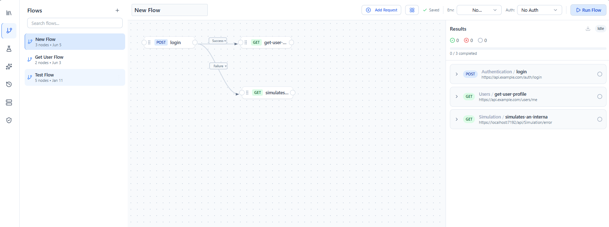
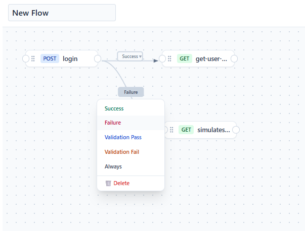
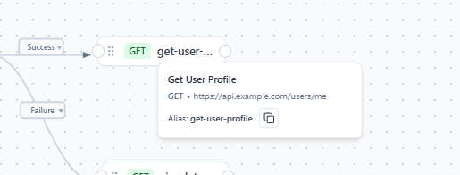

# Flows

A **flow** chains requests together on a visual canvas so the output of one step feeds the input of the next — for example: log in, capture the token, then call an authenticated endpoint.

Open the **Flows** tab in the sidebar to create and manage flows.

---

## The flow canvas

A flow is a set of **request nodes** connected by **connectors**. Add requests from your [collections](collections.md) to the canvas (you can add several at once), then connect them to define execution order.



---

## Connectors and conditions

Connectors define the path between nodes and can carry a **condition** so the flow branches based on the previous step's result — including **validation pass/fail** (see [Validations](validations.md)). Condition chips are color‑coded for readability in both light and dark themes.



---

## Passing data between steps (aliases & references)

Each request node has a readable **alias** (a deterministic kebab‑case name derived from the request, e.g. `get-employee`, with `-2`, `-3` suffixes to avoid collisions). You reference an earlier step's response in a later step using the alias plus a section and an optional JSONPath:

```text
{{alias.$body:$.data.id}}          # JSONPath into the response body
{{alias.$body:$..id}}              # recursive descent
{{alias.$body:$.users[?(@.active)].id}}   # filter expression
{{alias.$body:$.items[0:2]}}       # array slice
{{alias.$headers:content-type}}    # a response header
{{alias.$status}}                  # status code
{{alias.$statusText}}              # status text
```

Shorthand body forms are also supported: `{{$.data.id}}` and `{{data.id}}`.

To grab an alias quickly, hover a node's alias to open a card with a **Copy** button.



> Body references are evaluated with a full JSONPath engine, so recursive descent, wildcards, filters, and slices all behave consistently. (The older dot‑form `{{alias.$body.data.id}}` is intentionally not supported — use the `:` + `$` form above.)

---

## Running a flow

Run a flow to execute its nodes in order, following connector conditions. The results panel shows each node's actual on‑wire request and a consistent pass/fail status, with transport failures rendered as friendly errors (no bare `HTTP 0`) — the same representation used across the collection runner, test suites, and reports. You can export the results as a report — see [Reporting](reporting.md) and [how a result is classified](reporting.md#how-a-result-is-classified).

---

## Related guides
- [Collections](collections.md) — source of the requests you add to a flow
- [Variables](variables.md) — `{{...}}` resolution basics
- [Validations](validations.md) — branch connectors on pass/fail
- [Reporting](reporting.md) — export a flow run
