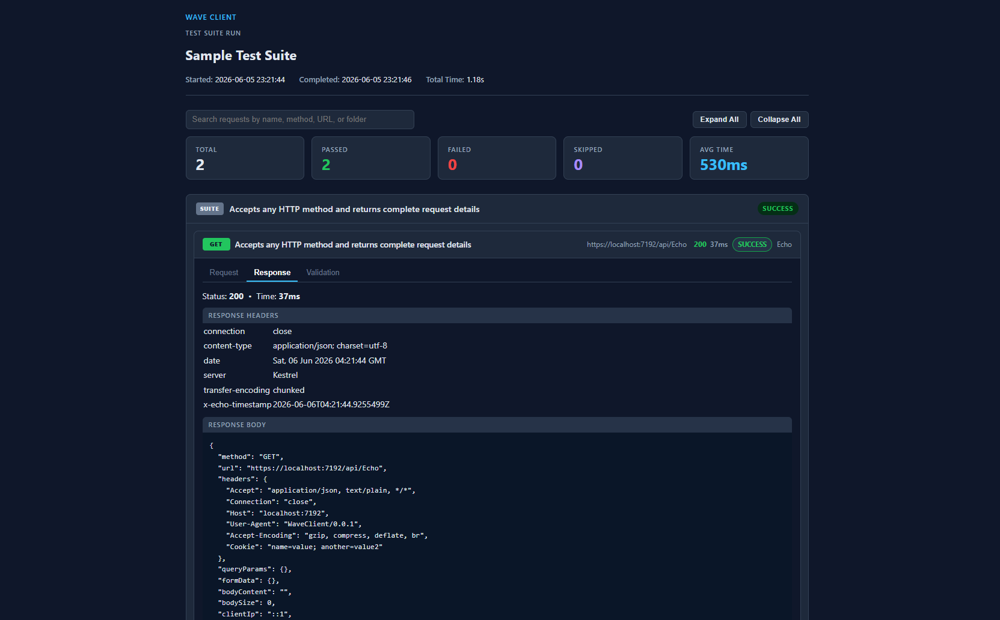

# Reporting

When you run a [collection](collections.md), [flow](flows.md), or [test suite](tests.md), Wave Client can produce an **HTML run report** you can save and share.

---

## What's in a report

- **Summary tiles** — Total / Passed / Failed / Skipped counts. Counts reflect the same classification used per request — see [How a result is classified](#how-a-result-is-classified).
- **Per‑request detail** — each request as an expandable card showing request and response details, with validation status surfaced for successful runs. The **Request** tab prefers the actual on‑wire request (the [Sent](requests.md) snapshot — final URL, headers, and body) over the configured request, so the report shows what was really sent.
- **Response rendering** — response and validation payloads render in horizontally scrollable code blocks, so long single‑line JSON stays readable. Base64‑encoded text responses are decoded before formatting.
- **Friendly errors** — transport failures (DNS, connection refused, timeout, TLS) render as a clear message with a hint instead of a bare `HTTP 0` / `Unknown Error`. A status code is shown only when there is a real HTTP response.

---

## How a result is classified

A single rule decides pass/fail everywhere — the collection runner, the flow runner, the test‑suite panel, and the HTML report all use it:

1. **No response / transport error** ⇒ **Failed** (with the friendly error message).
2. **A validation result exists** ⇒ pass/fail follows the validation (all rules passed ⇒ **Passed**). This means a request that *expects* a non‑2xx status — e.g. a rule asserting `400` — counts as **Passed**.
3. **Otherwise** ⇒ a `2xx`/`3xx` status is **Passed**, anything else **Failed**.

So an HTTP 200 with a failing validation is **Failed**, and a deliberate 400 matched by an "expect 400" rule is **Passed**. For test suites, a failing case rolls its item up to Failed, and a failing item rolls the suite up to Failed.

---

## Interacting with a report

The HTML report is self‑contained and interactive:

- **Search** top‑level cards by name, method, URL, and folder.
- **Filter** by status by clicking a summary tile; click the same tile again to clear the filter.
- **Expand All / Collapse All** toggles every request card at once.
- Long names and URLs show full text via native tooltips when truncated.

---

## Related guides
- [Collections](collections.md) — run a collection
- [Flows](flows.md) — run a flow
- [Test Lab](tests.md) — run a test suite
