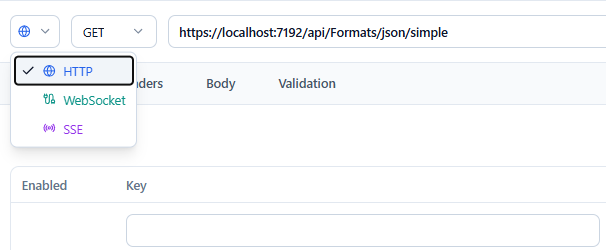
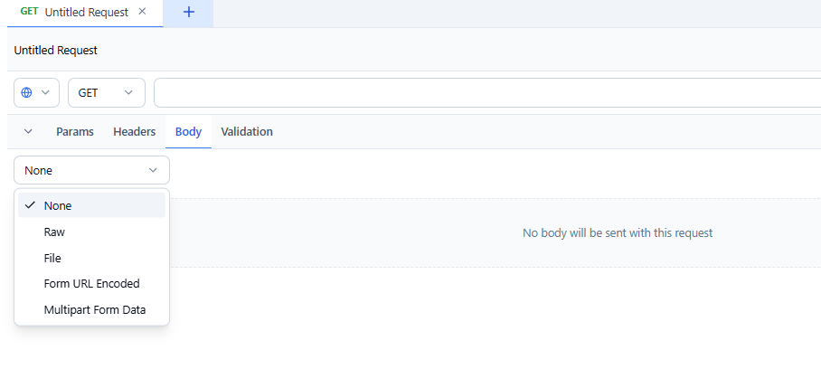
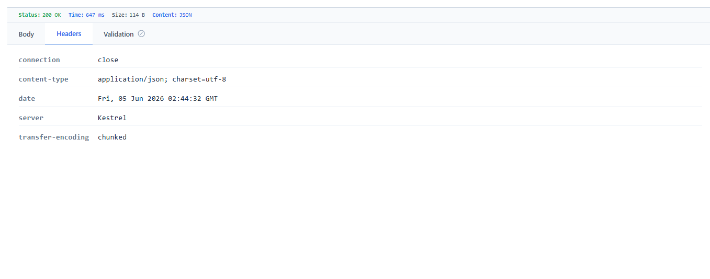
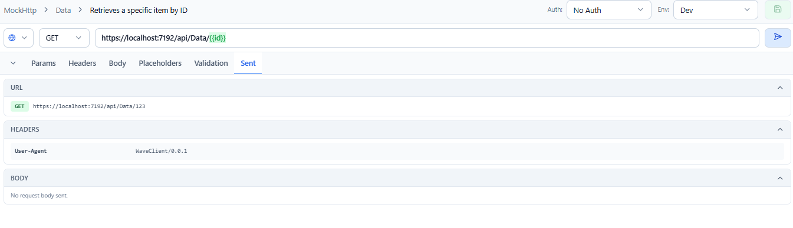
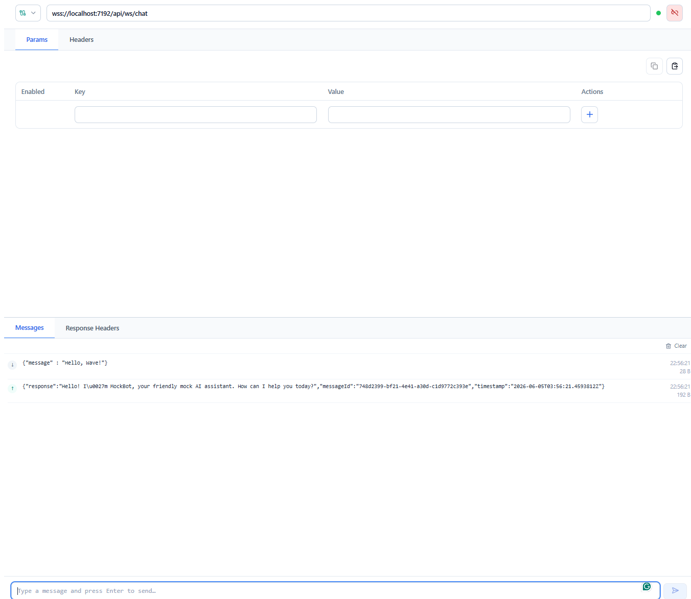
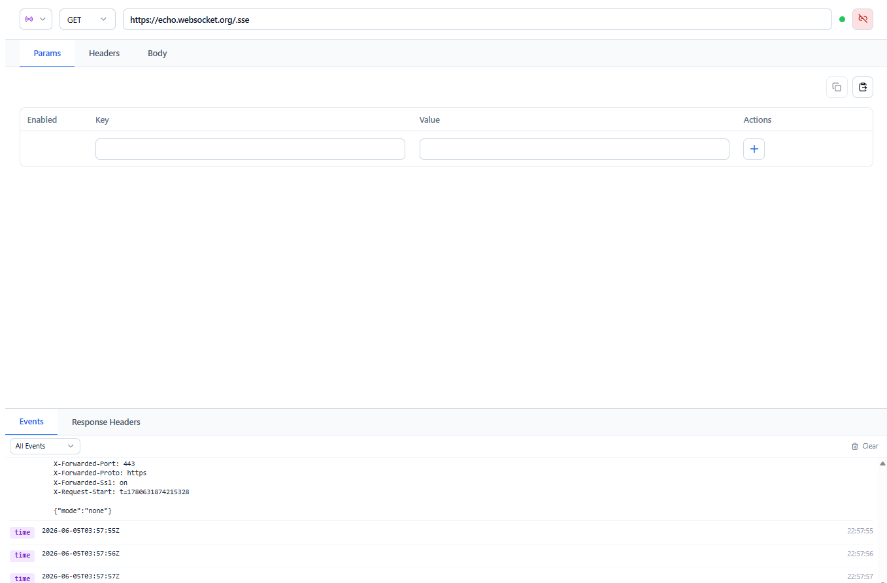

# Requests

A **request** is the core unit of Wave Client. Beyond classic HTTP, Wave Client speaks three protocols, all from the same editor:

- **HTTP** — request/response (GET, POST, PUT, DELETE, PATCH, …)
- **WebSocket (WS)** — a long‑lived, two‑way connection
- **Server‑Sent Events (SSE)** — a one‑way stream of events from the server

This guide covers building and sending requests. Topics that deserve their own page — [authentication](auth.md), [environments](environments.md), [variables](variables.md), and [validations](validations.md) — are linked where relevant rather than repeated here.

---

## Choosing a protocol

Every request tab has a **protocol selector** in the toolbar. Switching protocols reshapes the editor:

| Protocol | Method + Send? | Request sections | Output |
| --- | --- | --- | --- |
| **HTTP** | Yes | Params, Headers, Body | Response viewer |
| **WebSocket** | No (Connect/Disconnect instead) | Params, Headers | Messages + Response Headers |
| **SSE** | No (Connect/Disconnect instead) | Params, Headers, Body | Events + Response Headers |

Tabs show a colored badge for non‑HTTP requests (teal **WS**, purple **SSE**) instead of the HTTP method.

---

## HTTP requests

### URL and query parameters
Type the full URL into the address bar. Query parameters can be edited as key/value rows under the **Params** tab. You can use `{{variables}}` anywhere in the URL — see [Variables](variables.md).

### Headers
Add request headers as key/value rows under the **Headers** tab; toggle individual rows on or off without deleting them.

> Wave Client automatically adds a default `User-Agent` header identifying the client **only if you haven't set one yourself**. Provide your own `user-agent` header (any casing) to override it.

### Cookies
Cookies received from responses can be captured and persisted, then automatically reused on matching requests. Manage saved cookies in the [Wave Store](wave-store.md).

### Request body
Choose a body type for methods that send a body:

| Body type | Use it for |
| --- | --- |
| **None** | Requests without a body (typical GET) |
| **Raw** | Free‑form text with a language hint: **JSON**, **XML**, **HTML**, **Text**, or **CSV** |
| **URL‑encoded** | `application/x-www-form-urlencoded` key/value pairs |
| **Form‑data** | `multipart/form-data` with text **and file** fields |
| **File** | A single raw/binary file as the body |

Quick body samples and request formatting help you get started fast, and default headers are added to match the chosen body type.

### Authentication
Attach auth per request, or reference a saved credential. The supported types are API Key, Basic, Digest, OAuth2, and HMAC — see [Auth](auth.md).

### Placeholders
When a request uses `{{variables}}`, a **Placeholders** tab lets you preview each variable's resolved value and set **temporary, per‑request overrides** without editing your environments. Overrides are in‑memory only (never saved) and take precedence over environment values — see [Variables → Request placeholders](variables.md).

### Sending and the response viewer
Click **Send** to execute. The **response viewer** shows the status code, timing, response headers, and a formatted body (JSON, HTML, images, and more). Responses can be validated automatically — see [Validations](validations.md).

Use the **Download** action in the response body viewer to save the exact response bytes. Wave Client suggests a filename from `Content-Disposition` when present; otherwise it generates `response_<timestamp>.<ext>` using the response `Content-Type`.

### Cancelling a request
While a request is in flight, the **Send** button becomes a **Cancel** (stop) button — click it to abort instead of waiting for the request to time out. Cancellation aborts the actual outbound request (the server‑side call), not just the UI, so the connection is released immediately on both the desktop and web apps.

A cancelled request settles in the response viewer with a distinct **"Request cancelled"** state rather than an error. The request still appears in **History** (it is recorded when you press Send), and the editor is immediately ready for the next send.

### The "Sent" view
After a send, a request‑side **Sent** tab shows the exact on‑wire request for the most recent send:

- the **final URL** (with resolved query params),
- the **final headers**, and
- a **display‑safe body** with a format hint.

This is the source of truth for "what did Wave Client actually send?" Structured bodies (form‑data, url‑encoded) are shown as JSON; binary/file bodies are summarized to metadata only — raw bytes are never retained. The Sent tab appears only after a request has actually been sent.

---

## WebSocket requests

Select **WebSocket** as the protocol, set the URL (and any **Params**/**Headers**, including auth), then click **Connect**. A status indicator shows the connection state.

- The **Messages** panel shows a timeline of messages, tagged as **sent** or **received**.
- Type a message and send it over the open connection; your sent message appears immediately in the timeline.
- **Response Headers** shows the handshake response headers.
- Click **Disconnect** to close the connection.

Auth resolution for WS supports API key, Bearer (via API Key with a prefix), and Basic. A maximum number of concurrent connections is enforced for stability.

---

## Server‑Sent Events (SSE)

Select **SSE**, set the URL, optional **Params**/**Headers**, and (for POST‑based SSE) a **Body**, then click **Connect**.

- The **Events** timeline shows each event with its event name, data, and a timestamp.
- A **filter** dropdown lets you narrow the timeline to a specific event name, and **Clear** empties it.
- **Response Headers** shows the stream's response headers.
- Click **Disconnect** to close the stream.

SSE connections support custom headers, auth, and POST bodies (Wave Client uses a streaming HTTP client rather than the browser `EventSource`, so these all work).

---

## Keyboard shortcuts

| Shortcut | Action |
| --- | --- |
| `Ctrl+S` / `Cmd+S` | Save the active request — directly if it is already linked to a collection, or open the Save dialog if it is unsaved |

Shortcuts are scoped to the request editor. Pressing `Ctrl+S` / `Cmd+S` while the Save dialog is already open has no effect.

---

## Related guides
- [Collections](collections.md) — save and organize requests
- [Environments](environments.md) and [Variables](variables.md) — parameterize requests
- [Auth](auth.md) — authentication types
- [Validations](validations.md) — automatically check responses
- [Flows](flows.md) — chain requests together
