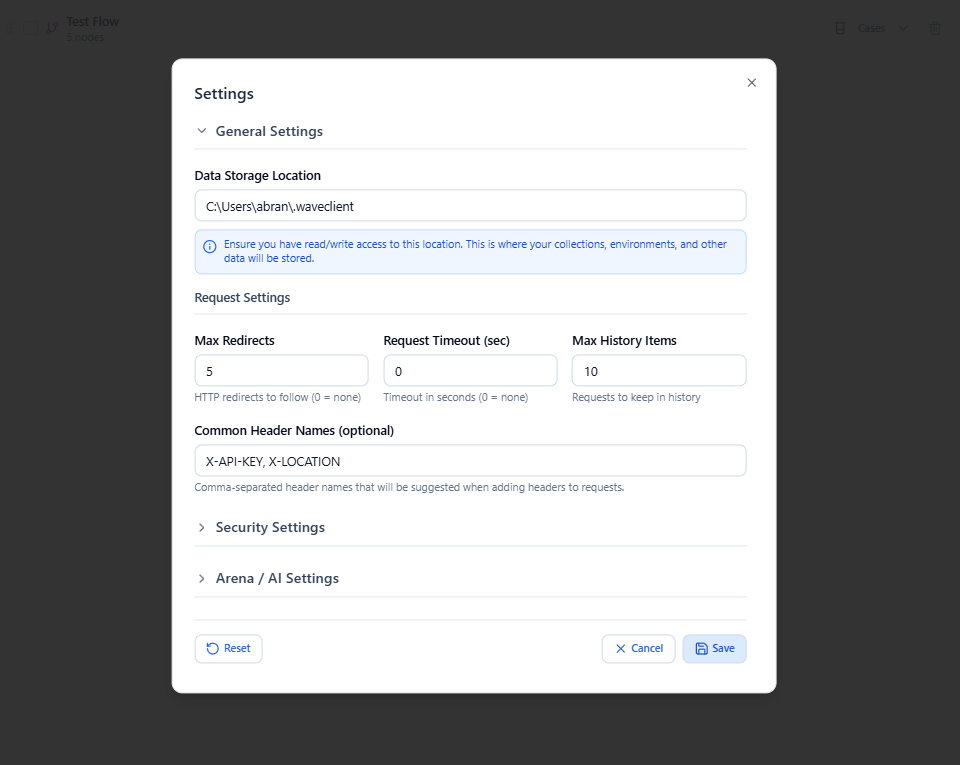
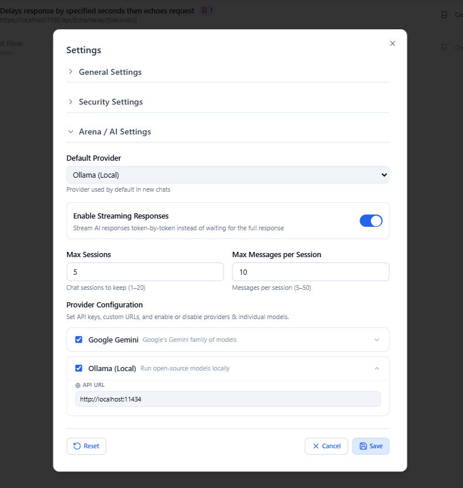

# Settings

Open **Settings** from the gear icon at the bottom of the sidebar. The settings wizard is organized into three collapsible sections.

---

## General Settings *(expanded by default)*

Covers **data storage** and **request‑related** controls:

- **Where data is stored** — the location Wave Client uses for your collections, environments, history, and stores.
- **Request controls** — request‑level preferences applied when sending.

In the **VS Code extension**, data is managed on your machine by the extension. In the **web app**, data is stored by the local [Wave Client server](../platforms/web-app.md).

---

## Security Settings

Controls **encryption** of your stored data:

- **Enable/disable encryption** with a password.
- **Change password**.
- **Export a recovery key** and **recover** with it if you forget your password.

Secrets are handled through platform‑secure storage (VS Code `SecretStorage` in the extension; server‑side encryption for the web app). See [Design & Architecture](../design.md) for how this is implemented.

---

## Arena / AI Settings

Configure the built‑in AI assistant — provider, model, and related options. See [AI & Wave Arena](ai-arena.md) for what the assistant can do.

---

## Related guides
- [Wave Store](wave-store.md) — the data that encryption protects
- [VS Code extension](../platforms/vscode.md) / [Web app](../platforms/web-app.md) — platform‑specific storage
- [AI & Wave Arena](ai-arena.md) — configure the assistant
