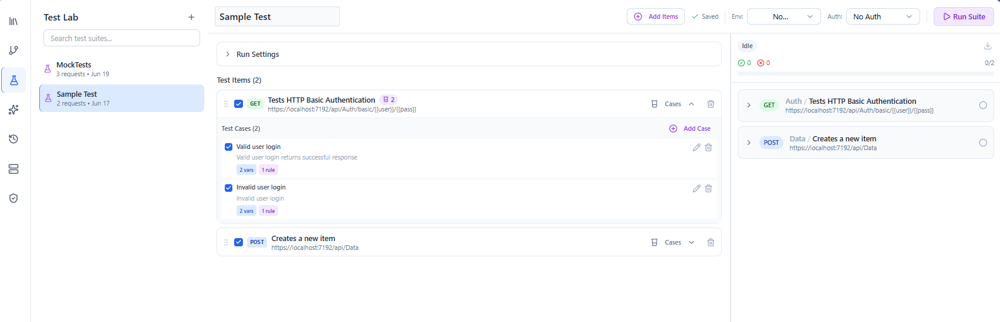
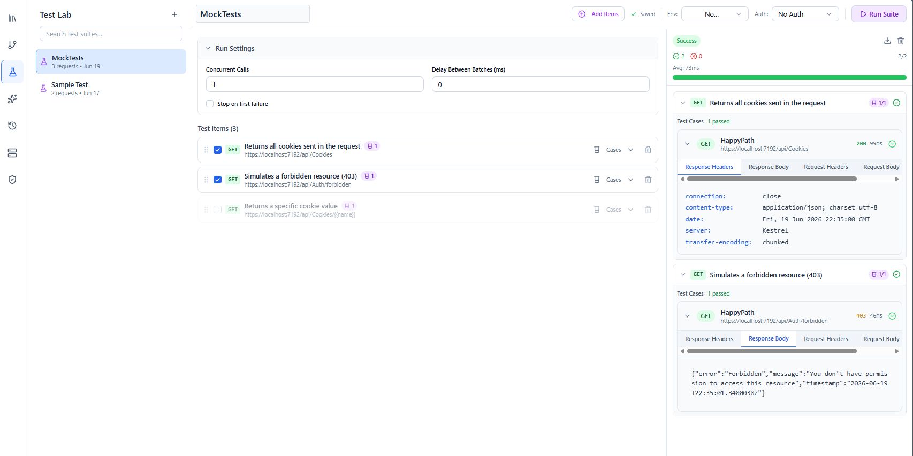

# Test Lab

The **Test Lab** lets you group requests into a **test suite** and run them together with assertions, so you can confirm an API behaves as expected in one click.

Open the **Test Lab** tab in the sidebar.

---

## Test suites

A **suite** is an ordered list of requests, each with its [validations](validations.md) acting as assertions. Add requests to a suite (you can select multiple at once), arrange them, and give the suite a name.

Each request in a suite carries its own validation rules; when the suite runs, those rules determine whether each step passes or fails. See [Validations](validations.md) for the available operators (status, headers, body via JSONPath/JSON Schema).

A suite item can reference a saved request **or** a [flow](flows.md). Run **settings** (concurrent calls, delay between calls, stop‑on‑failure) live in a collapsible **Run Settings** section in the editor body.

---

## Test cases

Each request item can hold one or more **test cases** — named scenarios that run the same request with different inputs (data‑driven testing). An item with no test cases simply runs once with no overrides.

Open a test case to edit it in a structured editor organized into collapsible sections. Every section is an **override** layered on top of the base request — leave a section empty to inherit the request's own value:

| Section | What it overrides | How it applies |
| --- | --- | --- |
| **Variables** | `{{variable}}` values for this case | **Merge** — overrides environment values by name; detected request placeholders are prepopulated, and you can add free‑form rows |
| **Headers** | Request headers | **Merge** — overrides by key (case‑insensitive) or adds new headers |
| **Query Params** | Query parameters | **Merge** — overrides by key or adds new params |
| **Body** | Request body | **Replace** — choose None / Raw / File / Form URL‑Encoded / Multipart; files are stored inline with the test case |
| **Auth** | Auth profile | **Replace** — swap the auth credential for this case |
| **Validation** | Assertions | **Replace** — when set, only these rules run for this case; the request's own rules are skipped |

The headers, params, and variables tables behave like the request editor's (styled `{{variable}}` inputs, enable/disable rows). The **Validation** section edits rules **inline** — "Add rule" expands the rule editor in place (no nested dialog) — and you can also link a global rule by reference. A note in that section reminds you that adding rules here *replaces* the request's rules for the case.

> **Override presence = intent.** Empty sections are omitted on save, so they fall back to the base request. Variable, header, and body overrides may contain secrets — they are kept with the suite file and never logged.

The test‑suite list shows each test case's full name, its description, and a compact summary of which overrides it defines.

---

## Running a suite

Run the suite to execute every request in order and evaluate its assertions. Each item runs once per enabled test case, applying that case's overrides. The result shows per‑request pass/fail and an overall summary, which you can export — see [Reporting](reporting.md).

A failing test case (by status **or** validation) rolls its item up to **Failed**, and any failing item rolls the whole suite up to **Failed**.

---

## File format & authoring

Test suites are stored as JSON. The format — every field, the merge‑vs‑replace override semantics, validation precedence, and tips for authoring suites by hand or with AI agents — is documented in the [Test Suite Schema Reference](../test-suite-schema.md). Suites are validated against this schema when loaded; a malformed suite is skipped with a visible error rather than crashing the app.

---

## Related guides
- [Validations](validations.md) — the assertions used in a suite
- [Requests](requests.md) — build the requests you add
- [Reporting](reporting.md) — export suite results
- [Flows](flows.md) — for data‑passing chains rather than independent checks
- [Test Suite Schema Reference](../test-suite-schema.md) — the persisted test‑suite file format
