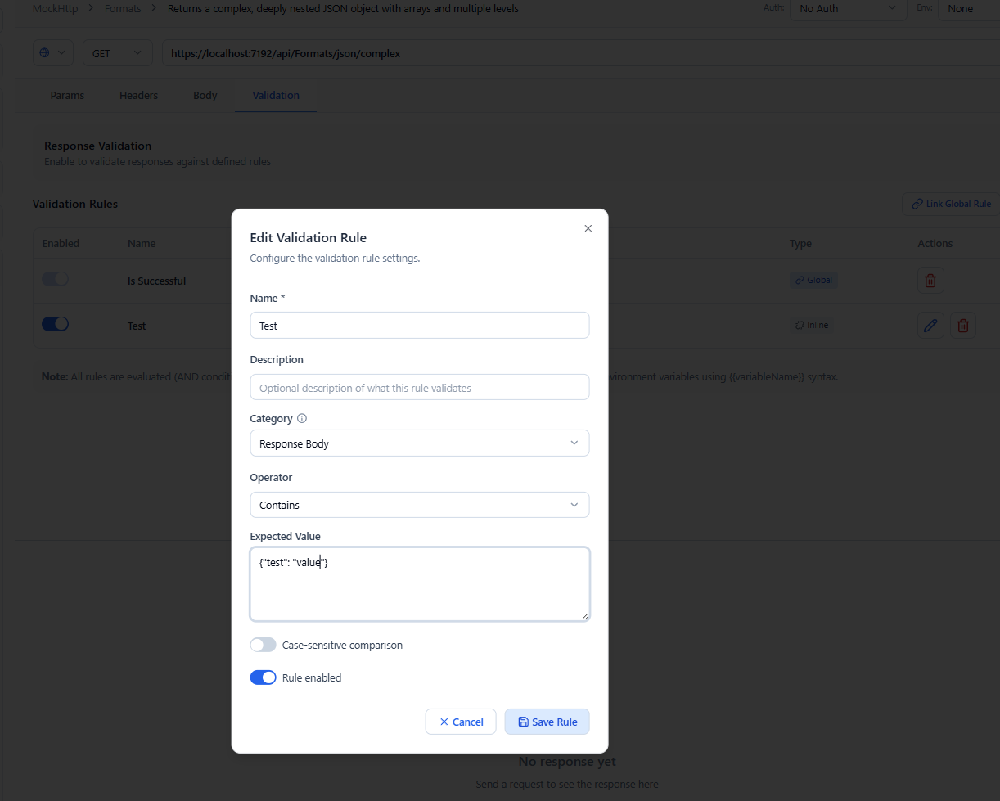
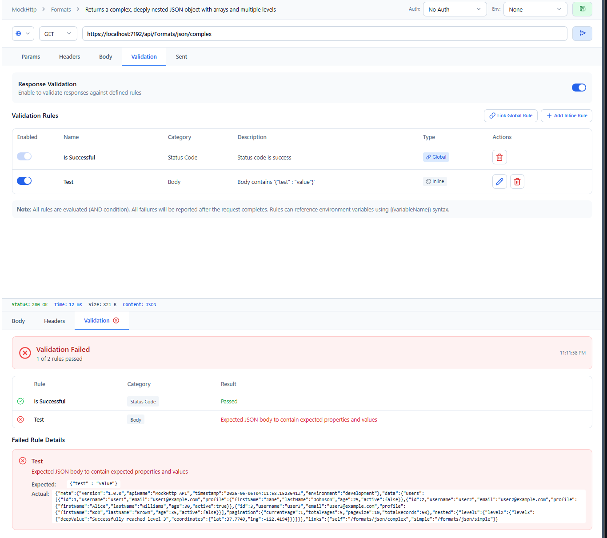

# Validations

Validations let Wave Client automatically check a response and mark it **pass** or **fail** — no manual inspection required. They power both ad‑hoc requests and automated [test suites](tests.md) and [flows](flows.md).

---

## How validation works

A validation **rule** targets part of a response and applies an **operator** with an expected value. When a request runs, all applicable rules are evaluated and the response is marked pass/fail accordingly.

> **Default behavior:** if no rules are defined, a response is considered successful when it returns a **2xx** status code.

---

## What you can validate

- **Status code** — assert the response status.
- **Headers** — assert a header value, including regex matching (`matches_regex`).
- **Body** — assert on the response body using:
  - **JSONPath** expressions (full JSONPath: recursive descent `$..`, wildcards `[*]`, array slicing, and filter expressions),
  - structural **JSON** comparison for `equals` / `not_equals` (deep equality), `contains` (subset match), and `not_contains` (property‑absence), and
  - **JSON Schema** validation (draft‑07) via the `json_schema_matches` operator.

When the editor needs you to provide a JSON Schema, it validates the schema as you type and shows a live valid/invalid indicator (a green check or a red X) so you catch mistakes before saving.

---

## Reusable rules

Validation rules can be saved and managed centrally in the [Wave Store](wave-store.md), so the same checks apply across many requests.

---

## Related guides
- [Requests](requests.md) — responses that get validated
- [Test Lab](tests.md) — assert across many requests in a suite
- [Flows](flows.md) — branch a flow on validation pass/fail
- [Wave Store](wave-store.md) — manage saved validation rules
