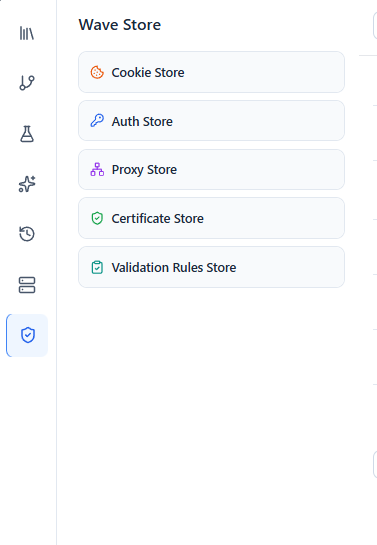

# Wave Store

The **Wave Store** is where Wave Client keeps reusable, cross‑request data so you don't have to redefine it every time. Open it from the **Wave Store** tab in the sidebar.

It holds four kinds of items:

| Store | What it holds | How requests use it |
| --- | --- | --- |
| **Cookies** | Cookies captured from responses or added manually | Active cookies are reused automatically on matching requests |
| **Auth** | Saved credentials (API Key, Basic, Digest, OAuth2) | Referenced by requests; **domain filters** control where each is sent |
| **Proxy** | HTTP/HTTPS/SOCKS proxy configurations | Applied when executing requests |
| **Cert** | Client certificates (mTLS) | Presented during TLS handshakes for matching hosts |

---

## Cookies
Wave Client can capture `Set‑Cookie` values from responses and persist them. A cookie manager lets you add and remove cookies, and active cookies are sent automatically on requests that match.

## Auth
Define a credential once and reuse it across requests. Each credential has a unique name, an enabled flag, optional expiry, and **domain filters** that restrict which hosts it applies to. See [Auth](auth.md) for the full list of supported types and options.

## Proxy
Store proxy settings (HTTP, HTTPS, or SOCKS) so requests can be routed through a proxy. Proxy and certificate handling are performed by the backend (the VS Code extension host or the local server).

## Cert
Store client certificates for **mutual TLS (mTLS)**. The matching certificate is presented automatically when connecting to hosts that require it.

---

## Related guides
- [Auth](auth.md) — supported credential types
- [Requests](requests.md) — where stored items are applied
- [Settings](settings.md) — where data is stored and how to encrypt it
