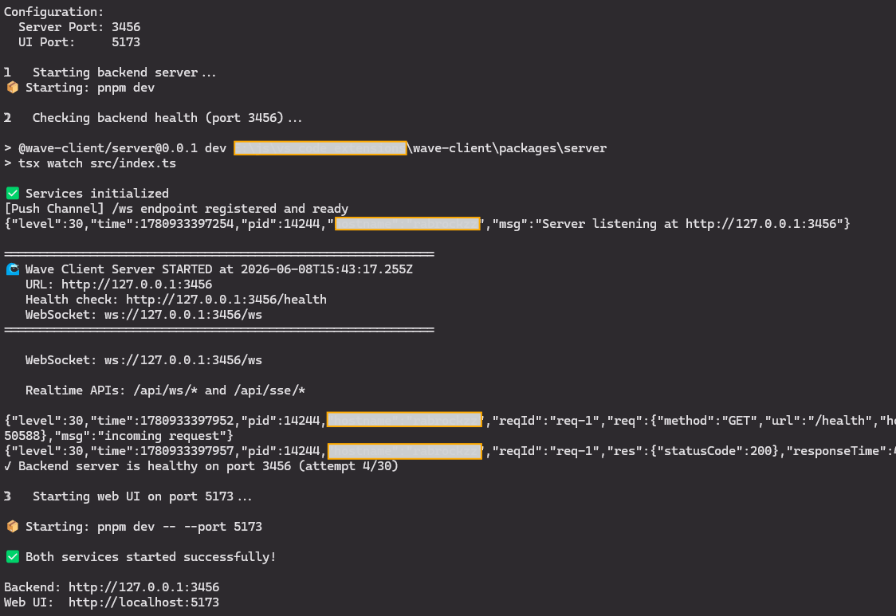

# Installation

Wave Client comes in two flavors. Pick the one that fits how you work — or use both; they share the same features and file formats.

- **[VS Code extension](#vs-code-extension)** — runs inside your editor, right next to your code.
- **[Web app](#web-app)** — runs in your browser, backed by a small local server.

> Looking for platform‑specific details after install? See the [VS Code guide](../platforms/vscode.md) and the [Web app guide](../platforms/web-app.md).

---

## VS Code extension

### Prerequisites
- **Visual Studio Code 1.103** or newer.

### Install
1. Open the **Extensions** view in VS Code (`Ctrl+Shift+X` / `Cmd+Shift+X`).
2. Search for **Wave Client** and click **Install**.

> During the public beta you may also install Wave Client from a packaged `.vsix` file via **Extensions → … → Install from VSIX…** if you received one.

### Open Wave Client
- Open the **Command Palette** (`Ctrl+Shift+P` / `Cmd+Shift+P`) and run **Wave Client: Open Wave Client**, or
- Press the keyboard shortcut **`Ctrl+Alt+W`** (**`Cmd+Alt+W`** on macOS).


Wave Client opens in an editor tab. Your collections, environments, history, and settings are stored by the extension on your machine — see [Settings](../features/settings.md) for where data lives and how to encrypt it.

Continue to the **[Quick Start](quick-start.md)**.

---

## Web app

The web app is a browser UI paired with a lightweight local **server** that performs file access, request execution (proxies, certificates), and encryption — things a browser can't do safely on its own. The published package bundles both: a single command starts the server, serves the UI, and opens your browser.

### Prerequisites
- **Node.js 18.18+** (LTS recommended)

### Install & run (from npm)
> **🚧 Not yet published — coming soon.** The web app isn't on npm yet, so the commands in this section are a **preview** of how installing it will work. Until the first release, run it from source instead — see **[Run from source](#run-from-source-contributors)** below.

Once published, the package name will be `@abranjith/wave-client`.

Run it directly with **npx** (no install):

```bash
npx @abranjith/wave-client
```

…or install it globally and run the `wave-client` command:

```bash
npm install -g @abranjith/wave-client
wave-client
```

This starts the local server, serves the UI on a **single port**, and opens **http://127.0.0.1:3456** in your browser.

Common options:

```bash
wave-client --port 8080                 # use a different port
wave-client --data-dir ./my-wave-data   # store data in a specific folder
wave-client --no-open                   # don't auto-open the browser
wave-client --help                      # all options
```



> Need to change ports, or the server won't start? See the [Web app guide](../platforms/web-app.md) for ports, the data directory, and troubleshooting.

Continue to the **[Quick Start](quick-start.md)**.

### Run from source (contributors)
If you're working in the monorepo, you can run the web app in dev mode — the UI (Vite) and server run as **separate** processes on separate ports:

```bash
pnpm install   # install the whole monorepo
pnpm dev:web   # starts the server (port 3456), then the web UI (port 5173)
```

Open **http://localhost:5173**. This dev workflow is for development only; end users should use the npm package above.

---

## Which one should I use?

| | VS Code extension | Web app |
| --- | --- | --- |
| **Best for** | Working alongside your code | Browser‑based workflows / demos |
| **Install** | VS Code Marketplace | npm (`npx` / global install) |
| **Backend** | VS Code extension host | Local Wave Client server |
| **Data storage** | Managed by the extension | Server file system |

Both share the same UI, the same request/collection/environment formats, and the same automation features — so you can move between them freely.
