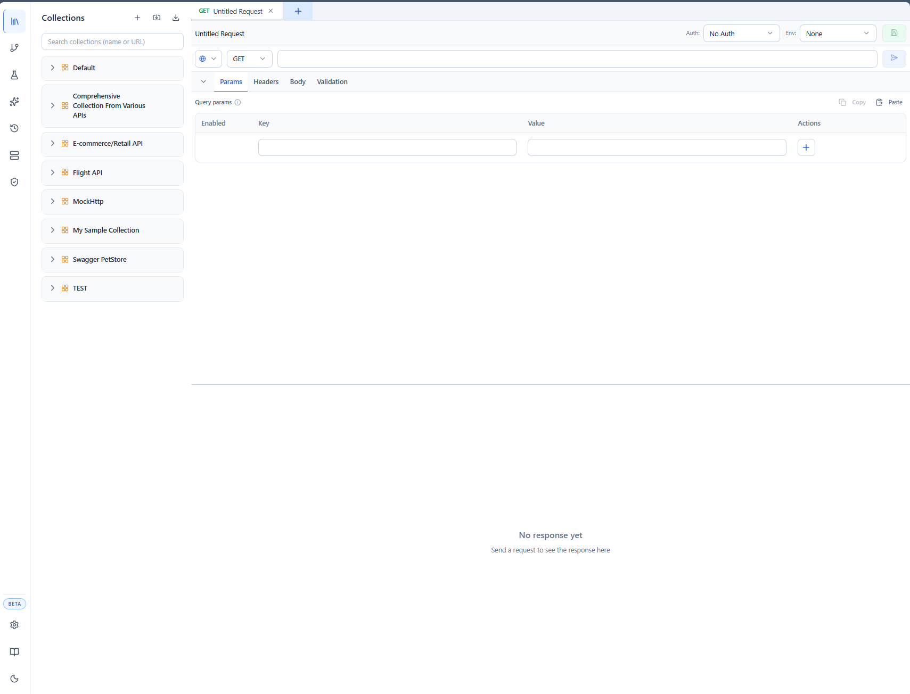
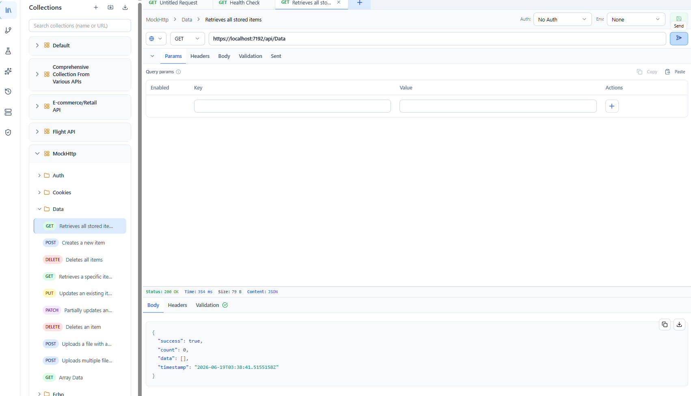
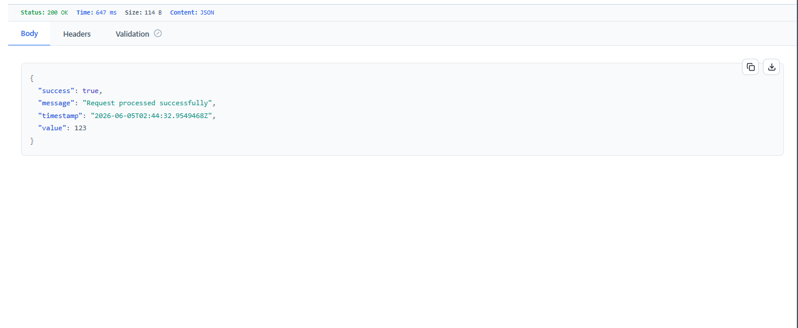
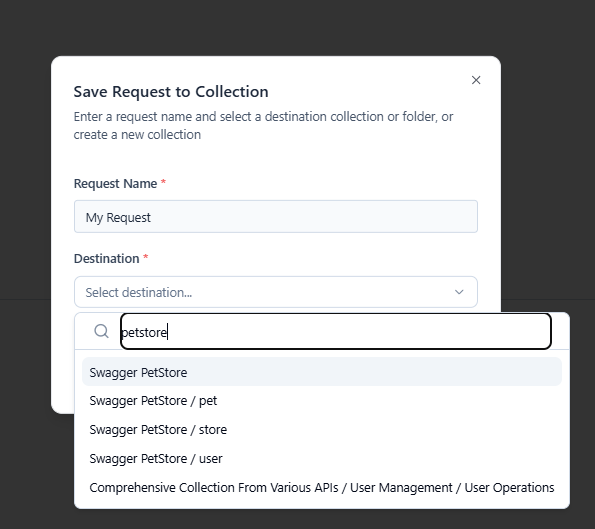

# Quick Start

This guide walks you through sending your first request and saving it for later. It assumes Wave Client is already installed — if not, start with [Installation](installation.md).

The steps are identical in the VS Code extension and the web app.

---

## 1. Open Wave Client

- **VS Code:** run **Wave Client: Open Wave Client** from the Command Palette, or press **`Ctrl+Alt+W`** / **`Cmd+Alt+W`**.
- **Web app:** open **http://localhost:3456** after installing package (*Coming soon*).

You'll see a left **sidebar** with tabs (Collections, Flows, Test Lab, Wave Arena, History, Environments, Wave Store) and a main area with the **request editor**.

---

## 2. Create a request

A new request tab opens with the HTTP method, URL bar, and request sections (Params, Headers, Body) ready to go.



> Want WebSocket or SSE instead of HTTP? Use the **protocol selector** in the toolbar — see [Requests](../features/requests.md).

---

## 3. Set the method and URL

1. Leave the method as **GET**.
2. Type a URL into the address bar, for example:

   ```text
   https://httpbin.org/get
   ```

3. (Optional) Add a query parameter under the **Params** tab, or a header under **Headers**.

You can use `{{variables}}` anywhere in the URL, headers, params, or body — see [Variables](../features/variables.md).

---

## 4. Send it

Click **Send**.



Wave Client executes the request and shows the result in the **response viewer**: status code, timing, response headers, and a formatted body.



> Curious exactly what went over the wire (final URL, resolved headers, body)? Open the **Sent** tab on the request side — see [Requests → The "Sent" view](../features/requests.md#the-sent-view).

---

## 5. Save it to a collection

To reuse a request later, save it into a [collection](../features/collections.md):

1. Click **Save**.
2. Pick an existing collection or choose **Create New Collection**.
3. Optionally place it inside a folder and give it a name.



Saved requests appear in the **Collections** tab in the sidebar, where you can organize them into folders, run them, or duplicate them.

---

## Where to next?

- **Parameterize for multiple environments** → [Environments](../features/environments.md)
- **Add authentication** → [Auth](../features/auth.md)
- **Validate responses automatically** → [Validations](../features/validations.md)
- **Chain requests together** → [Flows](../features/flows.md)
- **Build a test suite** → [Test Lab](../features/tests.md)
- **Ask the built‑in AI assistant** → [Wave Arena](../features/ai-arena.md)
