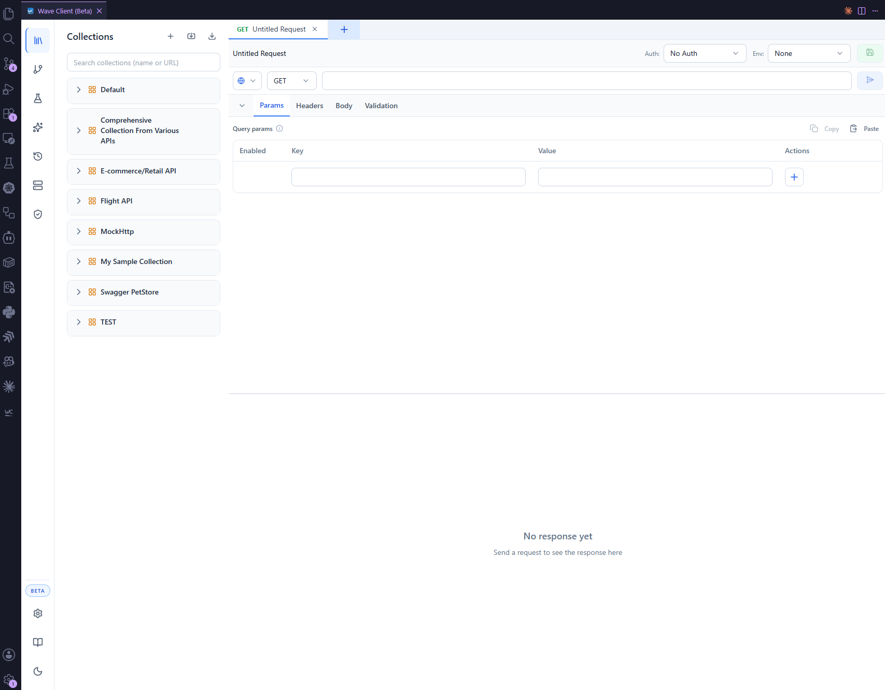

# VS Code Extension

The Wave Client VS Code extension brings the full client into your editor. This page covers VS Code‑specific details; for general usage, start with the [feature guides](../README.md#features).

For installation, see [Installation → VS Code](../getting-started/installation.md#vs-code-extension).

---

## Opening Wave Client

- **Command Palette:** run **Wave Client: Open Wave Client**.
- **Keyboard shortcut:** **`Ctrl+Alt+W`** (**`Cmd+Alt+W`** on macOS).

Wave Client opens in a webview panel.

---

## Documentation icon

Click the **Documentation** icon at the bottom of the left sidebar (next to Settings and the theme toggle) to open this documentation in your browser.

---

## Where your data lives

Collections, environments, history, cookies, auth, proxies, certificates, validation rules, and settings are stored on your machine by the extension. Secrets are kept in VS Code's **SecretStorage**. You can enable encryption for stored data in [Settings → Security](../features/settings.md#security-settings).

---

## Networking

The extension performs request execution in its Node.js backend, which means full support for:

- HTTP/HTTPS/SOCKS **proxies**,
- custom CA and **client certificates (mTLS)**, and
- request **cancellation** and timeouts.

Configure proxies and certificates in the [Wave Store](../features/wave-store.md).

---

## Theme

The webview follows light/dark styling and aligns with your VS Code theme.

---

## Related
- [Installation](../getting-started/installation.md)
- [Quick Start](../getting-started/quick-start.md)
- [Settings](../features/settings.md)
- [Web app](web-app.md) — the browser alternative
