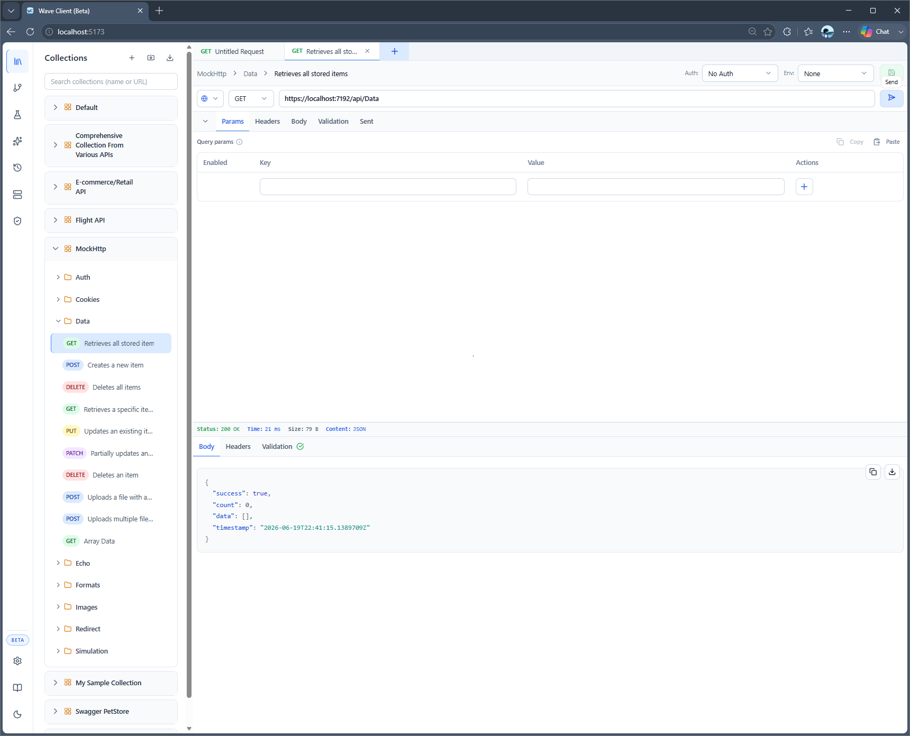

# Web App

The Wave Client web app runs in your browser and is backed by a small **local server**. The server handles the things a browser can't do safely on its own — file access, request execution with proxies/certificates, and encryption — while the browser renders the same UI as the VS Code extension.

For installation, see [Installation → Web app](../getting-started/installation.md#web-app).



---

## Running it

> **🚧 Not yet published — coming soon.** The web app isn't on npm yet; the commands below are a **preview**. For now, run it from source in the monorepo with `pnpm install && pnpm dev:web` (UI on port `5173`, server on `3456`).

Install from npm and run the `wave-client` command to start the server, serve the UI, and open your browser:

```bash
npx @abranjith/wave-client          # run without installing
# or
npm install -g @abranjith/wave-client
wave-client
```

This starts the bundled server, serves the UI from the **same port**, and opens your browser.

### Options
- `-p, --port <port>` — port to listen on (default `3456`, or `WAVE_PORT`)
- `--host <host>` — interface to bind (default `127.0.0.1`, or `WAVE_HOST`)
- `--data-dir <dir>` — where Wave stores data (default `~/.waveclient`, or `WAVE_DATA_DIR`)
- `--no-open` — don't auto-open the browser
- `-v, --version`, `-h, --help`

The UI and API share a single origin, so there's no separate UI port and no CORS to configure. By default the server binds to loopback only; use `--host 0.0.0.0` to expose it on a trusted network (there is no authentication).

> **Contributors:** in the monorepo, `pnpm dev:web` runs the UI (Vite, port `5173`) and server (port `3456`) as separate dev processes. That's for development only.

---

## Documentation icon

Click the **Documentation** icon at the bottom of the left sidebar (next to Settings and the theme toggle) to open this documentation in a new browser tab.

---

## Server connection status

The web app monitors the connection to the local server. If the server isn't running, a banner appears prompting you to start it. Start (or restart) the server and the app reconnects.

---

## Where your data lives

In the web app, your collections, environments, history, and stores are stored on your machine under `~/.waveclient` by default. Point it elsewhere with `--data-dir <dir>` (or the `WAVE_DATA_DIR` environment variable). See [Settings](../features/settings.md) for details and encryption.

---

## Troubleshooting

| Symptom | Fix |
| --- | --- |
| Banner: "Server disconnected" | The server stopped — rerun `wave-client` (contributors: `pnpm dev:server`). |
| Port already in use | Start on a different port: `wave-client --port <port>`. |
| UI loads but requests fail | Confirm the server is healthy at `http://127.0.0.1:<port>/health`. |
| `hnswlib-node` install error | The AI features use a native module. Ensure you're on Node 18.18+; on uncommon platforms a build toolchain may be required. |

---

## Related
- [Installation](../getting-started/installation.md)
- [Quick Start](../getting-started/quick-start.md)
- [Settings](../features/settings.md)
- [VS Code extension](vscode.md) — the editor‑integrated alternative
